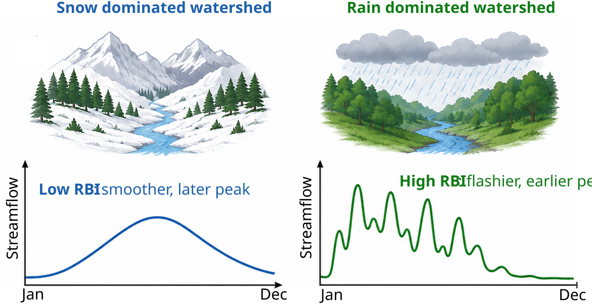
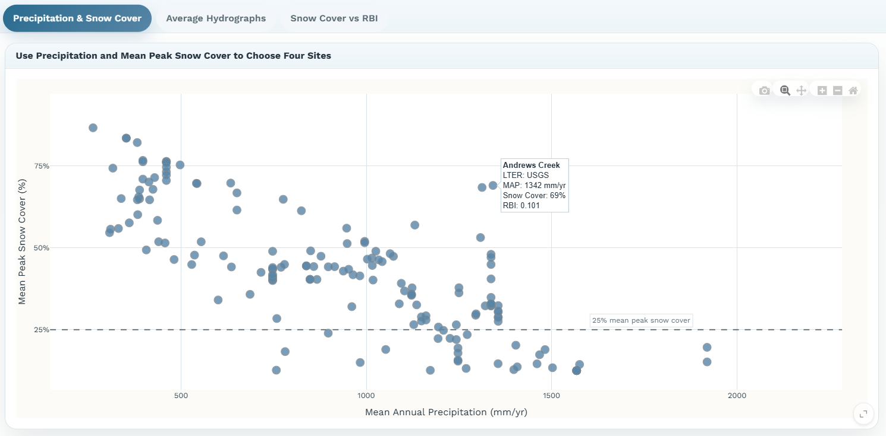

# Activity 1: Using Stream Hydrographs to Infer Subsurface Properties
## Introduction
Streams respond differently to rainfall and snowmelt depending on climate, landscape characteristics, and how water is stored and transported in the subsurface. In rain-dominated watersheds (e.g., watersheds where most of the precipitation falls as rain), precipitation often reaches streams quickly, producing rapid increases in streamflow during storms. In contrast, snow-dominated watersheds (e.g., watersheds where most of the precipitation falls as snow) store water seasonally in snowpack and release it gradually during spring melt, often resulting in smoother streamflow patterns. Hydrologists use hydrographs - which describe the amount of water in a stream over time (Figure 1) - to understand how streamflow varies through time and respond to incoming precipitation. However, hydrographs also provide a window into watershed processes that control the storage and transport of precipitation that are difficult to observe directly, such as groundwater storage and subsurface flow paths.
One commonly used hydrograph metric that provides insight into subsurface water storage and transport is the Richards-Baker Flashiness Index (RBI). RBI describes how rapidly streamflow changes through time; flashy streams (e.g., high values of RBI) respond quickly to storms and often indicate rapid runoff generation, suggesting limited storage capacity. Streams with low RBI values exhibit more stable flow and are less responsive to incoming precipitation, suggesting higher storage capacity resulting in buffering of streamflow response. By comparing RBI metrics across watersheds with different precipitation regimes, we can begin linking streamflow behavior to underlying hydrologic processes (Figure 1).

*Figure 1: Conceptual figure of hydrograph response for snow vs rain dominated watershed. Graphics created using ChatGPT.*

Understanding hydrograph behavior has important real-world applications in water resources management, flood forecasting, drought resilience, and ecosystem conservation. Water managers, hydrologists, and engineers routinely analyze hydrographs to predict flood risk, assess water supply reliability, and evaluate how watersheds may respond to climate change. For example, watersheds with highly flashy hydrographs may be more vulnerable to flooding after intense storms. As snowpacks decline and precipitation regimes shift in many regions, changes in hydrograph shape can provide clues to how watershed storage and transport are changing, and insights into managing water resources in a changing climate.

## Learning Objectives 
1. Analyze and interpret stream hydrographs to evaluate basin flashiness across contrasting precipitation regimes.
2. Relate quantitative hydrograph metrics to subsurface storage and streamflow generation processes.	

## Activity

From http://shiny.ceoas.oregonstate.edu/hydro-modules/, navigate to the Activity 1: Hydrographs & Subsurface tab to begin the first activity. This activity page consists of three tabs: Precipitation & Snow Cover, Average Hydrograph, and RCS vs RBI. Begin on the Precipitation & Snow Cover tab.

### Questions

1. The plot on the Precipitation & Snow Cover tab displays mean annual precipitation vs average snow cover. Each point is a watershed. The horizontal dashed line at 25% average snow cover and differentiates snow dominated watersheds ( > 25% snow cover) from rain dominated (< 25%) watersheds. Describe the relationship between annual precipitation and average snow cover. What does this tell you about water availability in snow dominated vs rain dominated watersheds?

2. Hovering over a point on the annual precipitation vs average snow cover plot will tell you information about the precipitation regime and storage in that watershed. If you select a point, the plot below will populate with monthly precipitation and snow covered area for that watershed. Select four points from the mean annual precipitation vs average snow cover plot. Select two rain dominated watersheds (snow cover < 25%) and two snow dominated watersheds (snow cover > 25%). Use the Controls panel on the left side of the screen to see which watersheds you have selected. You can deselect a point by clicking on it again. 

3. Scroll down to the plot below on this same tab, which now should show eight lines - two for each watershed. You can deselect sites by unchecking the box under Display sites such that only one watershed is plotted at a time. Describe the seasonal patterns of precipitation and snow cover in all four watersheds, noting which are rain dominated and which are snow dominated. Note the difference in the two y-axes. For the snow dominated sites, do the precipitation and snow cover lines exhibit similar seasonal patterns or different? Why might this be?

4. Navigate to the Average Hydrographs tab. The plot shows average hydrographs for each of the four watersheds previously selected from the Precipitation & Snow Cover tab. If the range in discharge values among watersheds is large and makes lower discharge rivers hard to see, you can select “Log-scale discharge axis” from the Controls panel to see the lower discharge watershed better. For each watershed, describe the hydrograph shape noting the timing of peak flow and the variability in flow (e.g, flashiness). Do you notice differences in the timing and flashiness of flow between non-snow dominated and snow dominated watersheds? What hydrologic processes might explain these differences?

5. Navigate to the Snow Cover vs RBI tab. The plot on this tab shows the relationship between Snow cover and RBI across the entire dataset. Describe the relationship between these two variables. What does this relationship tell you about how snow vs rain dominated streams respond to precipitation inputs?

6. In the questions above, we explored the relationship between snow dominance and watershed flashiness. However, other watershed characteristics, like land use, can influence stream flashiness. Using the drop down in the Controls panel color the points by land use. Describe patterns you observe with regard to land use - what land uses are associated with not flashy vs highly flashy systems? What are some hypotheses about why you might see these patterns? What role do you think anthropogenic modification of the landscape plays in stream flashiness?

