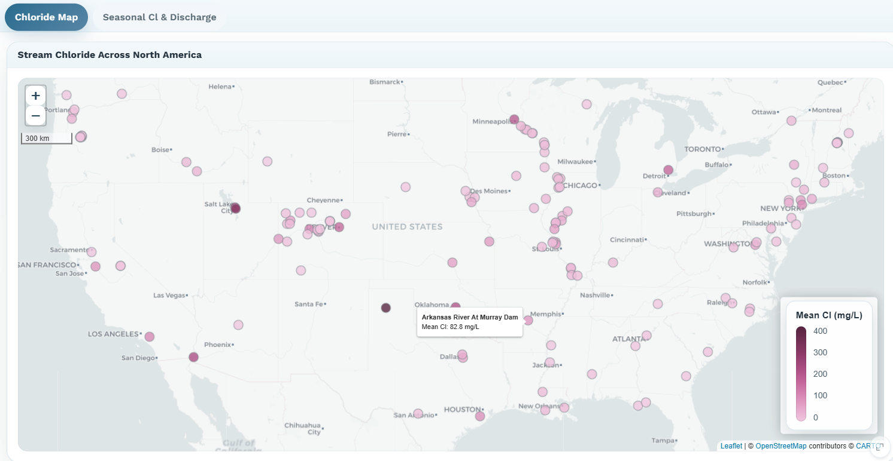

# Activity 2: Spatial and Seasonal Patterns of Stream Chloride
## Introduction
Streams naturally contain dissolved salts and minerals that originate from rocks, soils, groundwater, precipitation, and human activities. One of the most commonly measured dissolved ions in freshwater systems is chloride (Cl), which serves as an important indicator of watershed processes and human influence on water quality. Chloride enters streams through natural atmospheric deposition, and in some environments weathering processes - such as those underlain by evaporite bedrock - but elevated concentrations are often linked to road salt application, agricultural runoff, wastewater discharge, and urban development. Because chloride is highly soluble and does not readily react or precipitate in most freshwater systems, it can move efficiently through watersheds and provide insight into how water and dissolved materials are transported across landscapes.
Hydrologists often examine both the spatial distribution and seasonal variability of chloride concentrations to understand how climate, land use, and hydrology influence stream chemistry. Spatial patterns can reveal broad regional controls, such as differences in aridity, urbanization, or agricultural intensity. Seasonal patterns provide additional insight into watershed behavior by showing how chloride concentrations change in relation to stream discharge, snowmelt, or seasonal human activities. For example, chloride concentrations may become diluted during periods of high streamflow or increase during low-flow periods when groundwater contributions dominate in regions with high background chloride concentrations. In cold urban regions, winter road salt application can produce strong seasonal pulses of chloride to streams and rivers.
Understanding chloride dynamics has important real-world implications for water resource management, ecosystem health, and drinking water protection. Elevated chloride concentrations can alter freshwater ecosystem functioning, corrode infrastructure, and impair water supplies. As urbanization expands and climate patterns shift, many streams are experiencing increasing salinity, making chloride an important emerging water quality concern. By analyzing chloride patterns across diverse climates and land uses, we can better understand how human activities and hydrologic processes interact to shape water quality at both local and continental scales.

## Learning Objectives 
1. Evaluate spatial patterns of stream chloride concentrations across the United States and interpret how climate and land use influence salinity.
2. Evaluate temporal patterns of stream chloride and hypothesize how hydrologic and land use processes influence seasonal variation in salinity.

## Activity

From http://shiny.ceoas.oregonstate.edu/hydro-modules/, navigate to the Activity 2: Mapping Stream Salinity tab to begin the second activity. This activity page consists of two tabs: Chloride Map and Seasonal Cl & Discharge. Begin on the Chloride Map tab.

### Questions

1. The map on the Chloride Map tab displays average chloride concentrations measured at stream monitoring sites across North America.. You can hover over a point to see its name and average Cl concentration. Describe the geographic distribution of chloride concentrations across the map. Are there regions where concentrations appear consistently higher or lower? What are some hypotheses that could explain these patterns?

2. Using the Controls panel to the left of the map, add the precipitation basemap by selecting MAP (mm) from the Background Map dropdown menu. Describe any patterns you notice across precipitation gradients. Do chloride concentrations appear to vary with precipitation amount? If so, what hydrologic processes might explain these patterns?

3. Using the Controls panel to the left of the map, add the cropland basemap by selecting % Cropland from the Background Map dropdown menu. Describe any patterns you notice across cropland intensity gradients. Now add the impervious surface basemap by selecting % Impervious from the Background Map dropdown menu. We can interpret impervious surfaces as a proxy for urbanization, where more urbanized regions tend to have a larger proportion of impervious surfaces. Compare chloride concentrations across gradients in cropland intensity and impervious surface cover. Do either of these land-use characteristics appear related to chloride concentrations? What potential sources of chloride might be associated with agricultural and urban landscapes?

4. Select four sites on the map that span mean annual precipitation, percent cropland, and percent impervious surface gradients. Note the approximate precipitation (e.g., wet vs dry) and the land cover that seems to dominate each sampling location. For example, does a sampling location appear to be highly agricultural or urban? Navigate to the Seasonal Cl & Discharge tab, which has a plot showing monthly Cl concentrations. The four sites selected on the map on the Chloride Map tab will autopopulate into the will be shown on the plot. You can deselect sites by unchecking the box under Display sites such that only one watershed is plotted at a time. Describe the seasonal behavior of chloride in each river. During which months are concentrations highest and lowest? Are seasonal changes large or small relative to the average concentration?

5. In the Controls panel to the left of the plot, select the box labeled Overlay monthly discharge, which will add stream discharge on a secondary axis to this plot. Describe the relationship between seasonal Cl and seasonal discharge for each watershed. Do the timings of minimum and maximum values align or are they misaligned? What does the relationship between Cl and discharge suggest about the primary sources and transport pathways of chloride to the stream for each watershed?

6. Based on the spatial patterns observed across North America and the four rivers you examined in detail, develop a hypothesis about how controls on chloride concentrations differ between spatial and seasonal scales. What factors appear to influence chloride concentrations among watersheds versus seasonal chloride variability within a watershed?
