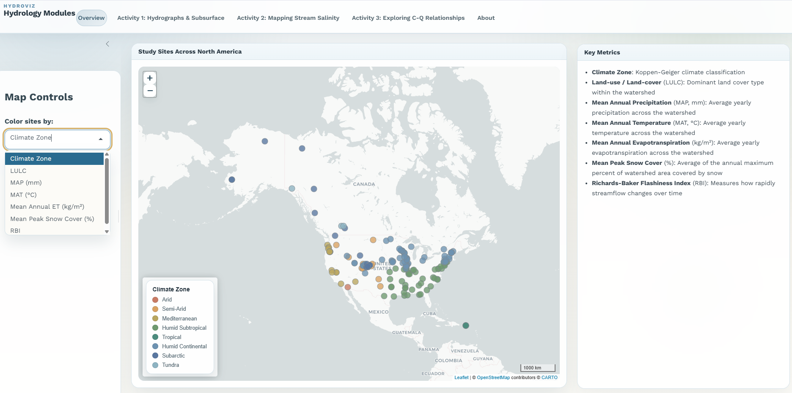

# Introduction

This resource contains three activities designed as plug-and-play modules on introductory hydrology material. Each activity introduces students to fundamental hydrologic and geochemical concepts through the exploration of real-world data from rivers across North America. Designed for upper-division environmental science and/or introductory hydrology courses, the modules pair guided activities with the HydroViz Shiny app, an interactive tool that allows students to visualize, explore, and compare hydrologic and water chemistry data. Each activity contains a link to a github folder. In each folder is the activity that can be downloaded as a pdf. The content paired with each module is on the open access HydroViz Shiny app: http://shiny.ceoas.oregonstate.edu/hydro-modules/

If you have questions, suggestions, or would like activity answer keys, etc. please email me at keira.johnson@colorado.edu.

# Activities
1. **Hydrographs and Subsurface:** *Introduction to hydrographs and precipitation and storage controls on stream discharge*
2. **Mapping Stream Salinity:** *Land use, precipitation, and discharge controls on stream salinity*
3. **Exploring C-Q Relationships:** *Differences between conservative vs non-conservative solute concentration-discharge relationships*

# Overview of HydroViz application

Link to the application: http://shiny.ceoas.oregonstate.edu/hydro-modules/

*Figure 1: Snapshot of the overview tab from the HydroViz interface.*

Launch the HydroViz Shiny App. The application may take a few moments to load while the server initializes; this is expected behavior. Across the top of the interface are five tabs: Overview, Activity 1, Activity 2, Activity 3, and About. Begin by opening the Overview tab. This page displays a map of the stream monitoring sites that will be analyzed throughout the module. Spend a few minutes familiarizing yourself with the Overview interface and the distribution of sites across North America. The appearance of the map can be modified using the Map Controls panel on the left side of the screen. Clicking on an individual site will display information about the watershed draining to that stream gauge. Descriptions of the watershed metrics and variables are provided in the Key Metrics panel on the right side of the interface. After exploring the overview map and becoming familiar with the controls, 
